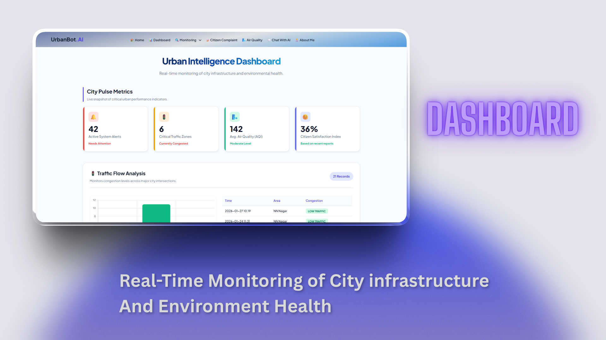
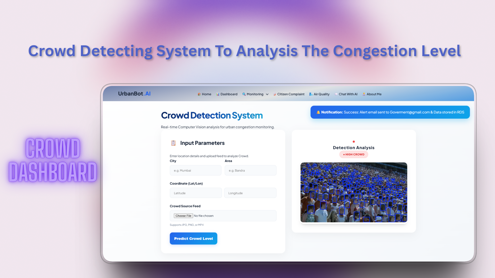
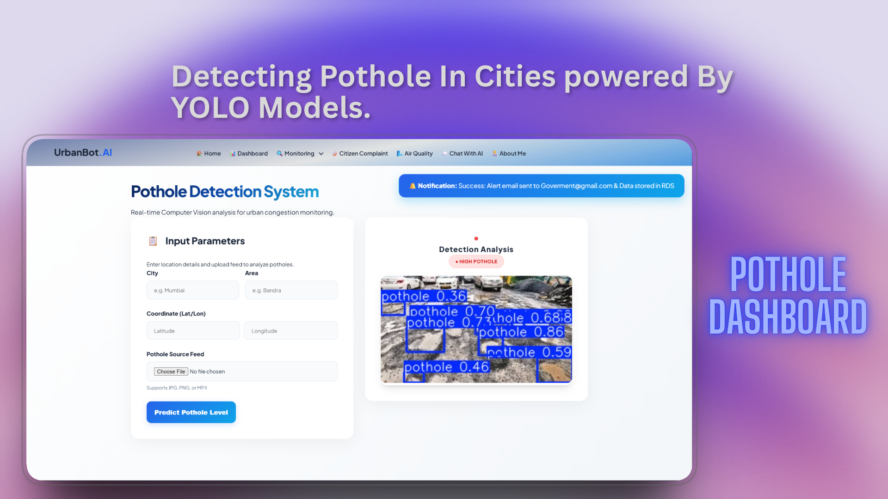
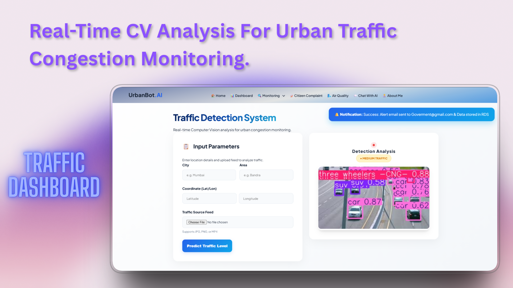
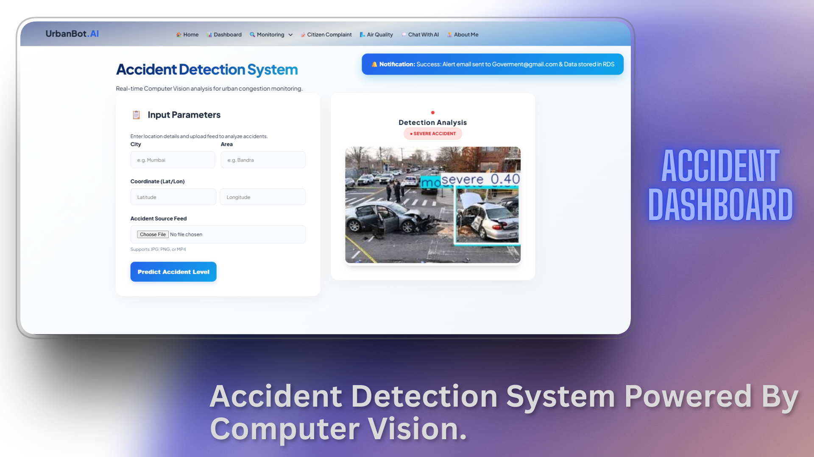
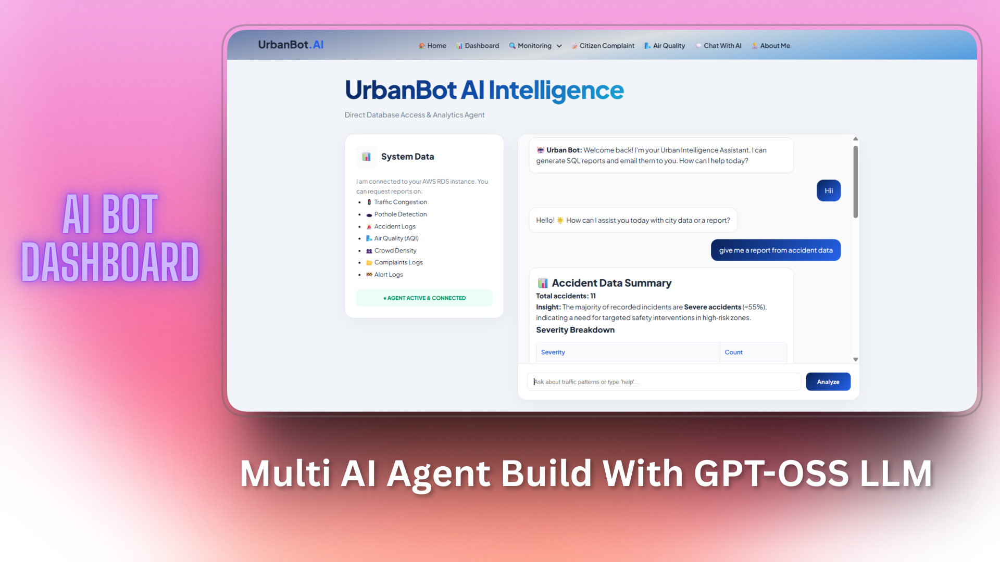
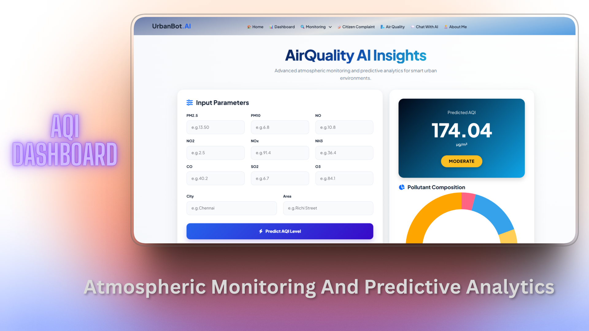
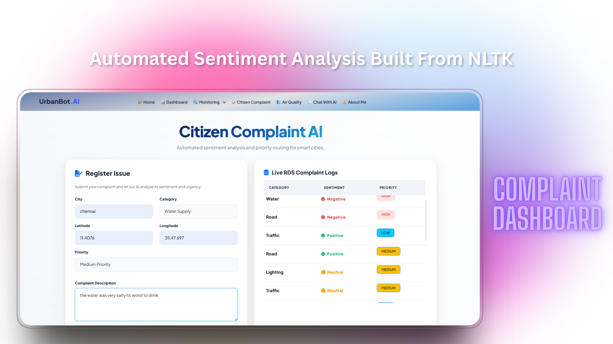

# UrbanBot Intelligence 🏙️
**Next-Gen Smart City Analytics Platform**

UrbanBot Intelligence is an integrated urban monitoring system leveraging **Computer Vision (YOLOv8)**, **Agentic RAG**, and **AWS Cloud Infrastructure**. It provides real-time insights into traffic flow, infrastructure health, and environmental conditions to optimize city management.

## pip install requirements.txt
---

## 🚀 Key Features
* **Infrastructure Monitoring:** Automated detection of potholes and accidents.
* **Crowd & Traffic Management:** Real-time density estimation and vehicle classification.
* **Environmental Insights:** 24-hour predictive Air Quality Index (AQI) modeling.
* **AI Agent Integration:** SQL-capable LLM agents for natural language reporting and automated alerts.

---

## 🏗️ System Architecture
The platform is architected for scalability using AWS:
* **Backend:** Flask (Python) hosted on **AWS EC2**.
* **Data Lake:** **AWS S3** for model weights and datasets.
* **Database:** **AWS RDS** for structured urban metrics.
* **Alerts:** **AWS SES** for automated emergency notifications.

---

## 📊 Platform Intelligence (Visual Tour)

Here is a look at the 8 core modules driving the UrbanBot ecosystem:

### 1. Urban Intelligence Dashboard

*Centralized command center for real-time city health metrics.*

### 2. Crowd Analysis System

*Density estimation using YOLOv8 to manage public hub congestion.*

### 3. Pothole Detection Engine

*Automated infrastructure scanning to prioritize road repairs.*

### 4. Traffic Monitoring

*Real-time vehicle classification and flow optimization.*

### 5. Accident Detection

*AI-driven collision detection with automated emergency triggers.*

### 6. AI SQL Agent

*Agentic RAG allowing natural language queries of the city database.*

### 7. AQI Analytics

*Deep learning models forecasting pollutant levels and environmental health.*

### 8. Citizen Complaint AI

*Sentiment-based NLP sorting to prioritize urgent infrastructure issues.*

---

## 🛠️ Tech Stack
* **Languages:** Python 3.9+
* **AI/ML:** PyTorch, Ultralytics (YOLOv8), Scikit-learn, Phidata (Agentic RAG)
* **Cloud:** AWS (EC2, S3, RDS, SES)
* **Web:** Flask, HTML5, CSS3, AOS (Animations)

